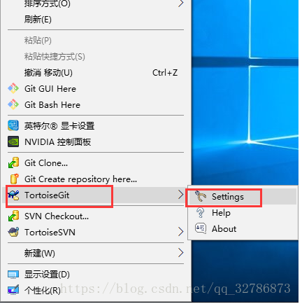

# linux下载安装git

## 安装

```
sudo apt-get install git
```

## 安装gui

```
sudo apt-get install git-gui
git gui//打开gui界面
```


## 配置邮箱和名字

```
git config --global user.name "yourname"
git config --global user.email "youremail@163.com"
```

## **生成ssh密钥**

```
ssh-keygen -C 'youremail@163.com' -t rsa
```

接下来会出现让你设置生成的ssh的保存路径以及密码，一路【回车】可以跳过。跳过的话，ssh密钥默认保存在`~/.ssh/`下（也就是用户的Home下面）。

## 添加密钥

登录[github](https://link.jianshu.com?t=https%3A%2F%2Fgithub.com)，进入个人的Settings页面，点击`SSH and GPG keys`，再点击`New SSH key`进行配置。
 在刚刚保存的路径`~/.ssh/`下找到公钥文件，`.`开头的文件夹为隐藏文件夹，使用`Ctrl +h`组合键查看隐藏文件。打开`.ssh`下的`id_rsa.pub`文件，复制所有内容到github上。

# git还原本地所有修改

```
git checkout . 
```


# git 将本地修改添加到stash中

```
git add .
```

# git删除子模块

To remove a submodule you need to:

- Delete the relevant section from the .gitmodules file.
- Stage the .gitmodules changes git add .gitmodules
- Delete the relevant section from .git/config.
- Run git rm --cached path_to_submodule (no trailing slash).
- Run rm -rf .git/modules/path_to_submodule (no trailing slash).
- Commit git commit -m "Removed submodule "
- Delete the now untracked submodule files rm -rf path_to_submodule


# git 添加子模块

```
git submodule add 仓库地址 路径
```

```
example:git submodule add git@github.com:huiGod/git_child.git mymodule
```


其中，仓库地址是指子模块仓库地址，路径指将子模块放置在当前工程下的路径。 
注意：路径不能以 / 结尾（会造成修改不生效）、不能是现有工程已有的目录（不能順利 Clone）

# git 子模块的使用

```
git submodule init
git submodule update
```

或者

```
git submodule update --init --recursive
```


# git和TortoiseGit使用同一SSH密钥

 

1. 安装git和TortoiseGit

2. 右键，选择Git GUI here，弹出下面对话框

   

3. 点击“Help”,选择“Show SSH key”

   

4. 如果没有生成公钥，点击“Generate Key”,生成公钥，如果已经生成公钥，点击复制

5. 打开git服务器，如github，点击“setting”，选择“SSH and GPG keys”,选择“New SSK key”,将刚才复制的git公钥复制到里面，添加成功

6. 将TortoiseGit配置为和git使用同一密钥，空白地方右键-->TortoiseGit-->Settings，将Network中的SSH client改为Git目录下的ssh.exe，**注意目录为Git/usr/bin/ssh.exe**

   


