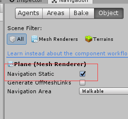
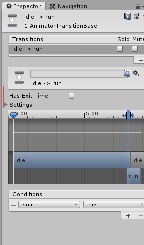
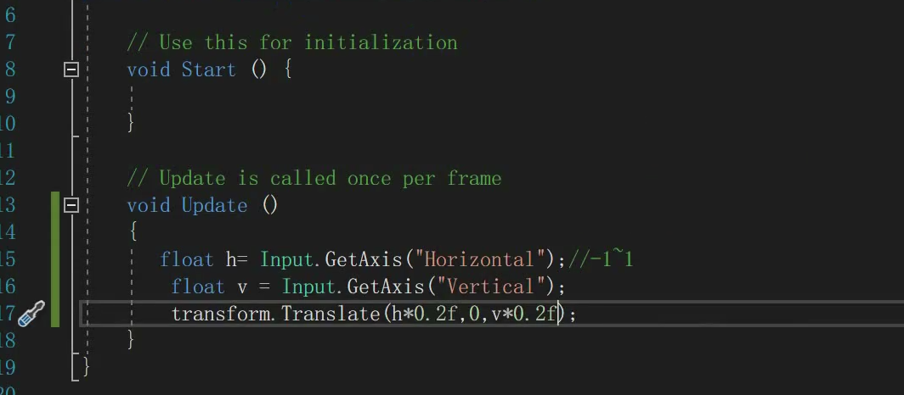

# 鼠标控制摄像机视野方向大小

```c#
void Update()
{
    // 滚轮实现镜头缩进和拉远
    if (Input.GetAxis("Mouse ScrollWheel") != 0)
    {
        Camera.main.fieldOfView = Camera.main.fieldOfView - Input.GetAxis("Mouse ScrollWheel") * sensitivetyMouseWheel;
        Camera.main.fieldOfView = Mathf.Clamp(Camera.main.fieldOfView, near, far);
    }
    //鼠标右键实现视角转动
    if (Input.GetMouseButton(1))
    {
        float rotationX = Input.GetAxis("Mouse X") * sensitivityX;
        float rotationY = Input.GetAxis("Mouse Y") * sensitivityY;
        transform.Rotate(-rotationY, rotationX,0 );
    }
    //键盘按钮←和→实现视角水平旋转
    if (Input.GetAxis("Horizontal") !=0)
    {
        float rotationZ = Input.GetAxis("Horizontal") * sensitivetyZ;
        transform.Rotate(0,0 , rotationZ);
    }
   
}
```


# unity Sorry, this link is no longer valid

关闭小飞机代理，重新启动uinty

# A*寻路算法

1. 创建地面，如plane

2. 点击windows->AI->navigation,打开Navigation窗口

3. 选中plane，切换到Navigation窗口，勾选Navigation Static选项

4. 创建寻路物体，如Cube，为cube添加Nav Mesh Agent组件

5. 通过调用nav.SetDestination(hit.point)函数设置目的地

6. 通过设置cube的Nav Mesh Agent组件的area Mask选项，设置cube的可寻路区域

7. 通过Navigation窗口的Areas选项，新增可寻路区域

8. 通过设置Navigation窗口的object选项的Navigation Area，设置plane寻路区域

9. 每次设置完后，需要点击Navigation窗口的bake选项的Bake按钮，重新烘焙

   

   ===================================================================

   

   =======================================================================

   

   =========================================================================

   

   

## 代码实例

```C#
public class playermove : MonoBehaviour
{
    NavMeshAgent nav;
    Animator anima; 
    // Start is called before the first frame update
    void Start()
    {
        nav = GetComponent<NavMeshAgent>();
        anima = GetComponent<Animator>();
    }

    // Update is called once per frame
    void Update()
    {
        if(Input.GetMouseButtonDown(0))
        {
            print("update_button_down");
            ControllMove();
        }
        if(Vector3.Distance(hit.point,transform.position)<0.5f)
        {
            anima.SetBool("isrun", false);
        }
    }

    RaycastHit hit;
    public void ControllMove()
    {
        Ray ray = Camera.main.ScreenPointToRay(Input.mousePosition);
        
        if(Physics.Raycast(ray,out hit))
        {
            print(hit.point);
            nav.SetDestination(hit.point);
            anima.SetBool("isrun",true);
        }
    }
}
```


# 创建多个相同物体（消消乐）

## 使用预制体创建多个cube

```
Color[] colors = { Color.blue, Color.red, Color.gray, Color.yellow };
void Start()
{ 
 for (int i = 0; i < 10; i++)
 {
 	for (int j = 0; j < 10; j++)
 	{
	 //使用预制体创建多个cube
	 GameObject cube = GameObject.CreatePrimitive(PrimitiveType.Cube);
	 cube.transform.position = new Vector3(i, j, 0);
 	cube.transform.localScale = Vector3.one * 0.9f;
 	cube.GetComponent<MeshRenderer>().material.color = colors[Random.Range(0, 		colors.Length)];
	 }
 }
}
```


## 使用定义好的cube创建多个cube

```
 public GameObject obj;
void Start()
{
	for (int i = 0; i < 10; i++)
	{
		for (int j = 0; j < 10; j++)	
		{
			//使用定义好的cube创建多个cube，Instantiate复制物体
			GameObject cube = Instantiate(obj);
			cube.transform.position = new Vector3(i, j, 0);
			cube.transform.localScale = Vector3.one * 0.9f;
			cube.GetComponent<MeshRenderer>().material.color = new Color(Random.Range(0, 1.0f), Random.Range(0, 1.0f), Random.Range(0, 1.0f));
		}
	}
}
```


## 使用资源文件创建多个cube

需要提前创建Resouces资源文件夹，在文件夹中放置想要创建的cube的样式材质


```
void Start()
{
	for (int i = 0; i < 10; i++)
	{
		for (int j = 0; j < 10; j++)
		{
			GameObject cube = Instantiate(Resources.Load("Cube" + Random.Range(1, 6))) as GameObject;
			cube.transform.position = new Vector3(i, j, 0);
			cube.transform.localScale = Vector3.one * 0.9f;
		}
	}
}
```


**注：创建多个相同物体时，为方便判断，可设置它们的tag相同**


# 射线检测

##  射线的创建和显示

​      创建一条射线Ray需要指明射线的起点（origin）和射线的方向（direction）。这两个参数也是Ray的成员变量。注意，射线的方向在设置时如果未单位化，Unity 3D会自动进行单位归一化处理。射线Ray的构造函数为 ：
 **public Ray(Vector3 origin, Vector3 direction);**


**RaycastHit**类用于存储发射射线后产生的碰撞信息。常用的成员变量如下：collider与射线发生碰撞的碰撞器
 distance     从射线起点到射线与碰撞器的交点的距离
 normal       射线射入平面的法向量
 point          射线与碰撞器交点的坐标（Vector3对象）


**Physics.Raycast**静态函数用于在场景中发射一条可以和碰撞器碰撞的射线


```C#
 void Update () 
 {  
     // 以摄像机所在位置为起点，创建一条向下发射的射线  
     Ray ray = new Ray(transform.position, -transform.up);  
     RaycastHit hit;  
     if(Physics.Raycast(ray, out hit, Mathf.Infinity))  
     {  
         // 如果射线与平面碰撞，打印碰撞物体信息  
         Debug.Log("碰撞对象: " + hit.collider.name);  
         // 在场景视图中绘制射线  
         Debug.DrawLine(ray.origin, hit.point, Color.red); 
     }  
 }  
```

## 定向发射射线的实现

**public Ray ScreenPointToRay(Vector3 position);**
 **参数说明：**position是屏幕上的一个参考点坐标。
 **返回值说明：**返回射向position参考点的射线。当发射的射线未碰撞到物体时，碰撞点hit.point的值为(0,0,0)。


**ScreenPointToRay**方法从摄像机的近视口nearClip向屏幕上的一点position发射射线。Position用实际像素值表示射线到屏幕上的位置。当参考点position的x分量或y分量从0增长到最大值时，射线将从屏幕的一边移动到另一边。由于position在屏幕上，因此z分量始终为0。


```C#
using UnityEngine;  
using System.Collections;  
  
public class RayDemo02 : MonoBehaviour {  
    Ray ray;  
    RaycastHit hit;  
    // 创建射线到屏幕上的参考点，像素坐标  
    Vector3 position = new Vector3(Screen.width/2.0f, Screen.height/2.0f, 0.0f);  
      
    void Update () {  
        // 射线沿着屏幕x轴从左向右循环扫描  
        position.x = position.x >= Screen.width ? 0.0f : position.x + 1.0f;  
        // 生成射线  
        ray = Camera.main.ScreenPointToRay(position);  
        if(Physics.Raycast(ray, out hit, 100.0f))  
        {  
            // 如果与物体发生碰撞，在Scene视图中绘制射线  
            Debug.DrawLine(ray.origin, hit.point, Color.green);  
            // 打印射线检测到的物体的名称  
            Debug.Log("射线检测到的物体名称: " + hit.transform.name);  
        }  
    }  
}
```

```
//创建射向鼠标位置的射线
Ray ray = Camera.main.ScreenPointToRay(Input.mousePosition);
RaycastHit hit;
if(Physics.Raycast(ray,out hit) && Input.GetMouseButtonDown(0))
{
if(hit.collider.tag == "Cube" )
{
hit.collider.gameObject.GetComponent<MeshRenderer>().material.color = Color.gray;
} 
}
```


#  unity动画

## 模型导入

模型导入：选中模型拖拽到场景中

## 动画导入

动画导入：

1. 给场景中的模型添加Animator组件

2. 创建一个动画控制器（Animator Controller）并指定到模型的Animator上

3. 打开动画控制器，将对应的动画片段拖拽到控制器中。

   

## Unity动画的播放

在Animator中指定模型的Avatar

运行程序，人物开始播放动画

AnyState：任何状态 

Entry：动画的入口

Exit：结束动画

 

右键点击控制器中的动画片段，通过makeTransition 控制动画的播放顺序

### 动画循环播放


## Avatar骨骼配置

Unity骨骼系统：Avatar

导入模型以后，配置模型的Avatar

1）确保每个骨骼对应的位置正确

2）确保模型程T姿势站立


## 动画切换

1. 通过makeTransition 连接动画片段

2. 添加条件值，如bool，trigger

3. 点击动画片段之间的连接线条，设置播放动画得条件（通过刚添加的条件值）

4. 在脚本中编写代码，设置条件值

   ```
   animator.SetBool("isRun",true);
   animator.SetTrigger("Attack");
   ```

5. 播放需要持续性的动画时（跑，走），使用bool,播放触发性的动画（技能，跳），使用trigger

   ### 动画切换没有间隙

   点击动画之间的连接线，不勾选Has Exit Time选项

   

 ## 代码示例

攻击动画

1.获取到鼠标按键:Input.GetMouseButtonDown(0)

2.控制Attack属性触发:animator.SetTrigger("Attack");

```
 Animator animator;
 // Start is called before the first frame update
 void Start()
 {
 	animator = GetComponent<Animator>();
 }
void Update()
{
    //按下W键
    if(Input.GetKey(KeyCode.W))
    {
    //Debug.Log("按下W键");
    //设置条件
    animator.SetBool("isrun",true);
    }
    if (Input.GetKeyUp(KeyCode.W))
    {
    //Debug.Log("按下W键");
    //设置条件
    animator.SetBool("isrun", false);
    }

    //0，1，2分布代表鼠标左键，右键，滚轮按下
    if(Input.GetMouseButtonDown(0))
    {
    animator.SetTrigger("isattack");
    }
}
```


# ui 物件

## 音乐播放

1 可在Main Camera上添加Audio source 属性，设置Audio clip的值选择播放音乐


2 可通过AudioSource的volume属性设置音乐声音

3 可通过AudioSource的mute属性设置是否静音

4 可声明AudioClip变量加载音乐

```
public AudioClip[] clips = new AudioClip[3];
```

5 可通过调用AudioSource的Play函数播放音乐


## 输入框：InputField

## 滑动条：Slider

## 提示消息：Text

可通过Text 的text属性获取内容

## panel:iamge

1 可添加button属性点击image

2 可添加Grid Layout group属性，使物体顺序排列，可设置Cell Size 和Spacing设置格子大小和间距


3 当panel中的物体过于多时，可添加Mask属性，只显示物体的一部分，然后通过滚动条显示所有物体

4 可通过设置image的Fill Amount 属性显示部分图片，要实现物体明暗变化，可叠加两张相同图片


## 复选框：Toggle

1 可通过获取Toggle的isOn属性获取选中与否状态

2 可将多个复选框结合，每次只能选中一个，方法如下

1. 添加空物体Empty

2. 将多个复选框添加到空物体下方

3. 在空物体下方添加Toggle Group属性

4. 选中所有复选框，将空物体拖拽到复选框的Group属性框中

5. 将其中的一个复选框的ison属性勾选，其余复选框不勾选ison

   


## 滚动条：Scrollbar

1 可通过设置Scrollbar的direction属性设置滚动条的方向


2 要使物体添加滚动条，需要先创建滚动条，然后给物体添加Scroll Rect 属性，并将创建的滚动条赋值


# unity基础

## 判断两个坐标的位置

```
Vector3.Distance(position1,position2);
```


## 世界坐标系为左手坐标系

1. 左手坐标系: 伸开我们的左手, 掌心向外, 大拇指与食指成90度, 中指、无名指和小指弯曲, 大拇指指向的方向就是X轴正方向, 食指指向的方向就是Y轴正方向, 中指、无名指和小指指向的方向就是Z轴正方向

2. 右手坐标系: 伸开我们的右手, 掌心向内, 大拇指与食指成90度, 中指、无名指和小指弯曲, 大拇指指向的方向就是X轴正方向, 食指指向的方向就是Y轴正方向, 中指、无名指和小指指向的方向就是Z轴正方向。

3. 左手坐标系和右手坐标系中, X轴和Y轴的方向是相同的, Z轴的方向相反。

   


**注：一般常见的用法, 是使得X正方向为正右方, Y正方向为正上方, Z正方向为正前方。**


## 按下W键

```
//按下W键
if(Input.GetKey(KeyCode.W))
{
}
```


## 按下鼠标左键

```
//0，1，2分布代表鼠标左键，右键，滚轮按下
if(Input.GetMouseButtonDown(0))
{

}
```




## 使用unity中的ui物件

### 引用头文件

```
using UnityEngine.UI
```

### 在start函数中初始化物体 

```
 user = user.GetComponent<InputField>();
```

### 设置物体显示隐藏状态


```
 panel.SetActive(true);
```

### 给iamge添加button属性

设置点击button后触发的函数


### 设置image完全填充

选中image，点击下方红色选中区域，按住“Alt”键，点击右下角


### 切换场景

点击file，点击buildsetting，将scene拖拽到弹出的对话框中，后面会显示场景序号，根据序号可切换场景，点击右上角关闭按钮，关闭对话框


切换场景需要引用如下命名空间

```
using UnityEngine.SceneManagement;
```

```
//LoadScene参数为场景序号，通过该函数切换场景
SceneManager.LoadScene(2);
```

## 获取时间增量

```
t += Time.deltaTime; //Time.deltaTime时间增量，平均0.02s
```


## float 转int

```
float f = 10.2;
int i = (int)f;
```


## 数字转字符串

```
float f = 10.2;
string s = f.ToString()
```


## 打印日志

```
Debug.Log("helloworld");
print("hello world")
```


## 设置物体初试位置

```
transform.position = new Vector3(0,0,0);
```


## 控制物体移动

```
transform.position += new Vector3(0.1f, 0, 0);
```


## 控制物体变大

```
transform.localScale += new Vector3(0.01f, 0.01f, 0.01f);
```


## 控制物体旋转

```C#
transform.Rotate(new Vector3(0, Time.deltaTime*100, 0 ));
```

```C#
//listcubes[0].transform.Rotate(0,1,0);
//绕世界坐标系旋转
listcubes[0].transform.Rotate(0,1,0,Space.World);
```


## 新建场景

```
ctrl+N
```

## unity导入资源

Assert->import package->custom package

## unity导出资源

Assert->Export package

## 直接复制粘贴

```
ctrl+D
```

## 查看视野四周

```
Alt+鼠标左键
```

## 平移视野

```
按住鼠标滑轮
```

## 场景规则

```
一个场景由若干游戏物体组成，一个游戏物体由若干组件组成
```

## persp透视视野（视图）

近大远小，使用人眼观察

##  ISO平行视野

游戏物体一样大小

## Move To View

将选中的gameObject移动到Scene Camera视野的正中间


## Align With View

将选中的gameObject与Scene Camera的Transfrom重合。如果选中的是Camera，那么，此Camera正好显示Scene面板中的画面。